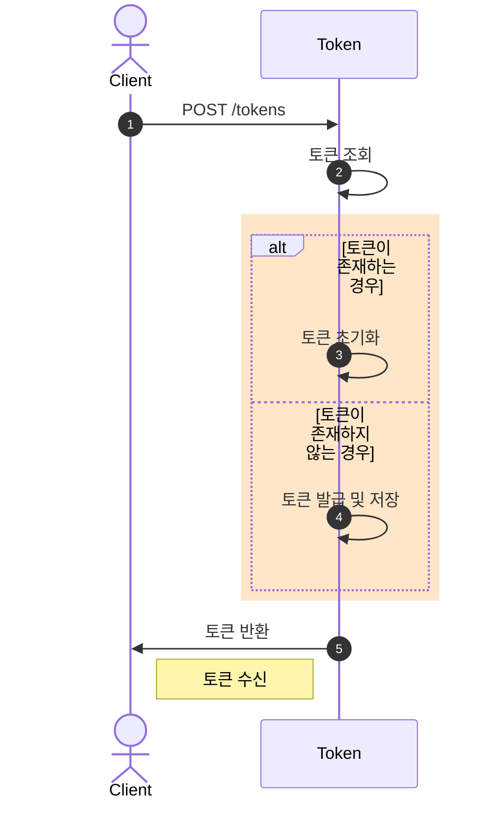
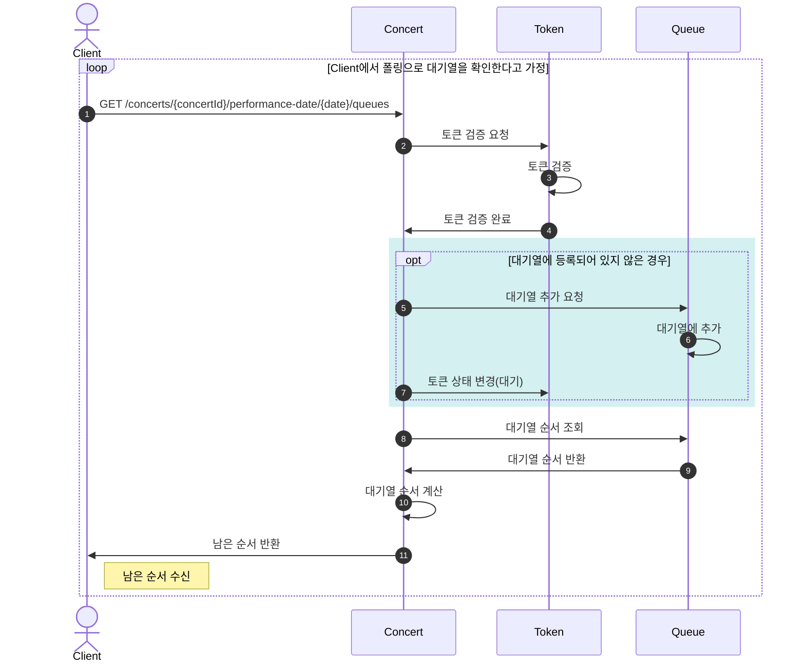
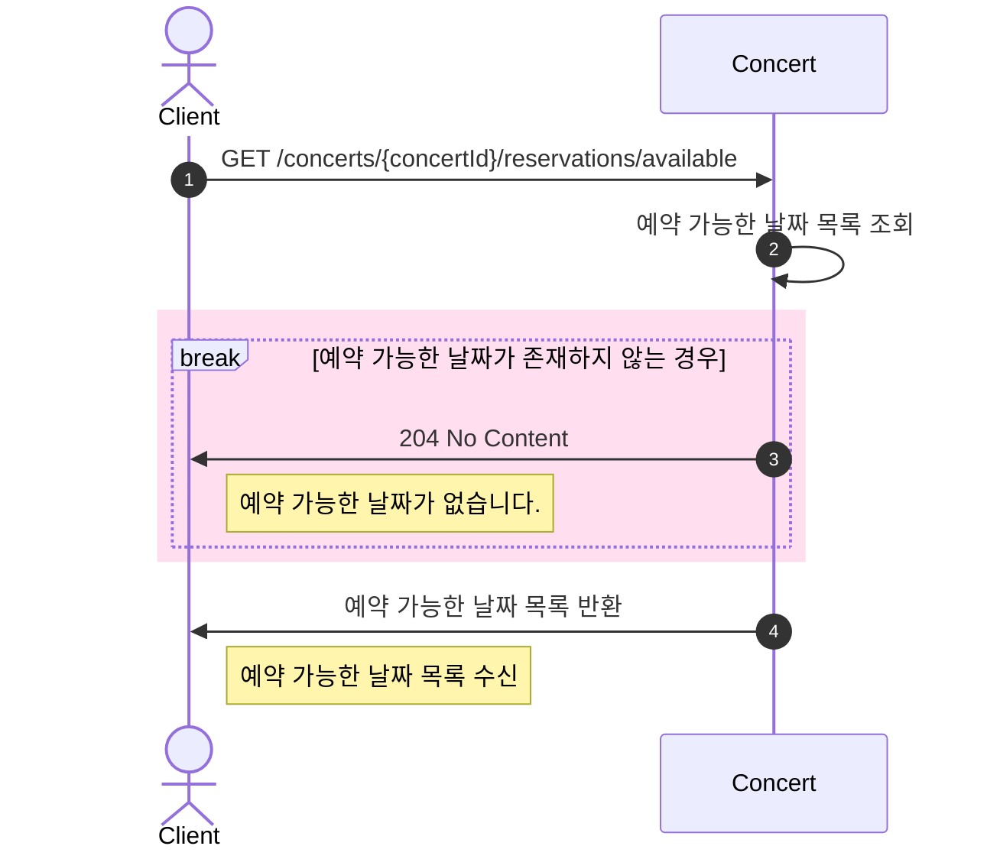
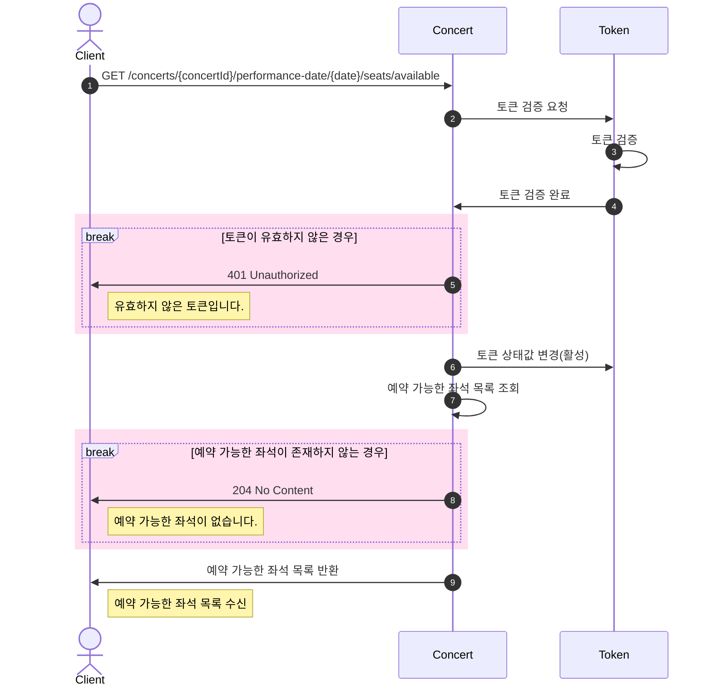
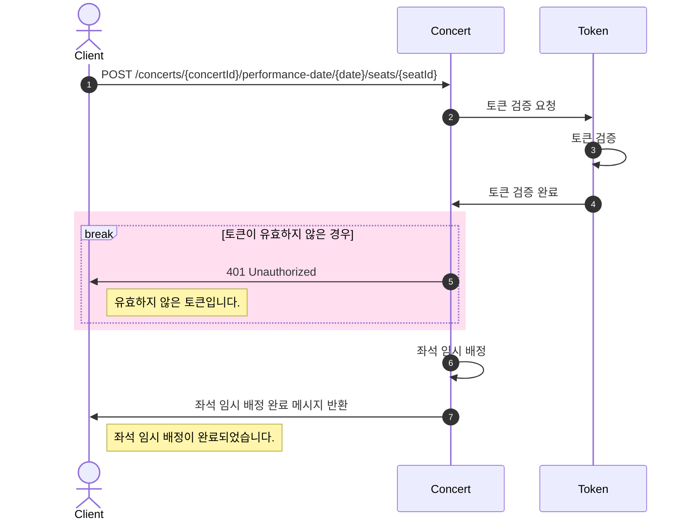
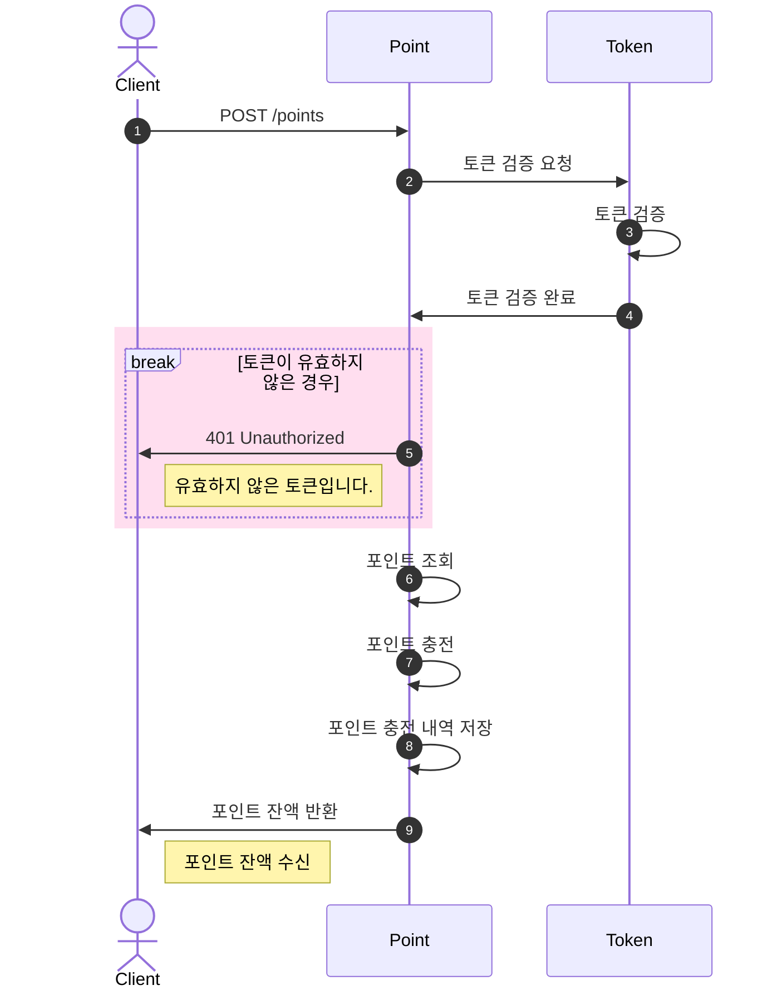
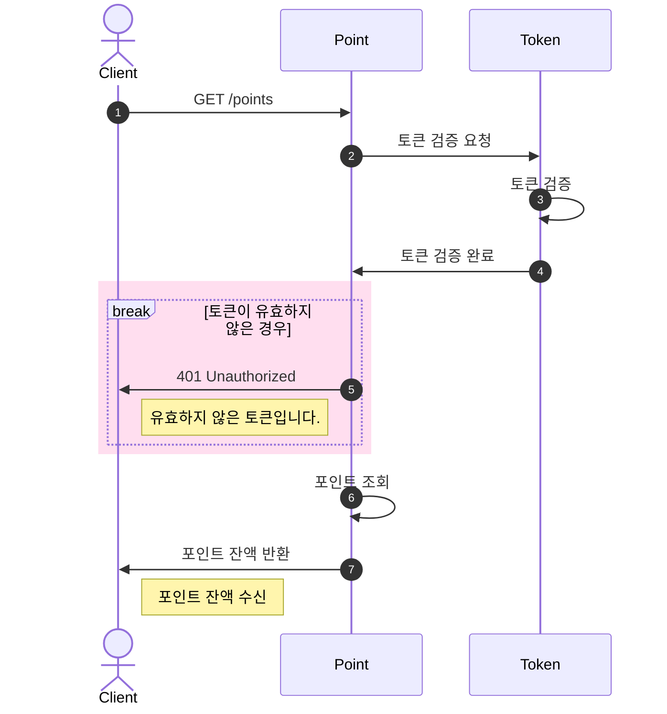
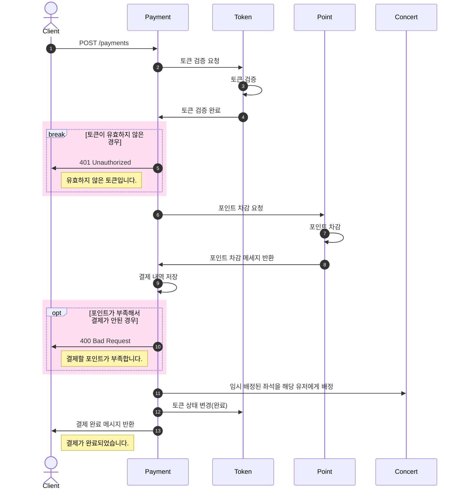

# 콘서트 예약 서비스
* 콘서트 예약 서비스 구현
* 사용자는 좌석예약 시 미리 충전한 잔액 사용
* 대기열 시스템 구축
* 좌석 예약 요청 시 결제가 이루어지지 않더라도 일정 시간동안 다른 유저가 해당 좌석에 접근할 수 없도록 제어

## API Specs
1. 유저 대기열 토큰 기능
   * 서비스를 이용할 토큰을 발급받는 API를 작성
   * 토큰은 유저의 UUID 와 해당 유저의 대기열을 관리할 수 있는 정보(대기 순서 or 잔여 시간 등) 를 포함
   * 이후 모든 API는 위 토큰을 이용해 대기열 검증을 통과해야 이용 가능
    > 기본적으로 폴링으로 본인의 대기열을 확인한다고 가정, 다른 방안 또한 고려해보고 구현 가능

2. 예약 가능 날짜 / 좌석 API
   * 예약가능한 날짜와 해당 날짜의 좌석을 조회하는 API를 각각 작성
   * 예약 가능한 날짜 목록을 조회 가능
   * 날짜 정보를 입력받아 예약가능한 좌석정보를 조회 가능
    > 좌석 정보는 1 ~ 50 까지의 좌석번호로 관리

3. 좌석 예약 요청 API
   * 날짜와 좌석 정보를 입력받아 좌석을 예약 처리하는 API를 작성
   * 좌석 예약과 동시에 해당 좌석은 그 유저에게 약 5분간 임시 배정(시간은 정책에 따라 자율적으로 정의)
   * 만약 배정 시간 내에 결제가 완료되지 않는다면 좌석에 대한 임시 배정은 해제되어야 하며, 다른 사용자는 예약할 수 없음

4. 잔액 충전 / 조회 API
   * 결제에 사용될 금액을 API를 통해 충전하는 API를 작성
   * 사용자 식별자 및 충전할 금액을 받아 잔액을 충전
   * 사용자 식별자를 통해 해당 사용자의 잔액을 조회

5. 결제 API
   * 결제 처리하고 결제 내역을 생성하는 API를 작성
   * 결제가 완료되면 해당 좌석의 소유권을 유저에게 배정하고, 대기열 토큰을 만료시킴

## Milestone
[Project Milestone Link](https://github.com/users/Yn3-3xh/projects/1/views/1)

## Domain Modeling

    

## Sequence Diagram
### 1. 유저 대기열 토큰 기능
[유저 대기열 토큰 기능 Sequence Diagram](https://github.com/Yn3-3xh/hanghae-backend-plus/issues/4)

**토큰 발급 API**

**대기열 확인 API**

### 2. 예약 가능 날짜 / 좌석 API
[예약 가능 날짜 / 좌석 API Sequence Diagram](https://github.com/Yn3-3xh/hanghae-backend-plus/issues/5)

**예약 가능 날짜 조회 API**

**좌석 조회 API**

### 3. 좌석 예약 요청 API
[좌석 예약 요청 API Sequence Diagram](https://github.com/Yn3-3xh/hanghae-backend-plus/issues/6)

**좌석 예약 요청 API**

### 4. 잔액 충전 / 조회 API
[잔액 충전 / 조회 API Sequence Diagram](https://github.com/Yn3-3xh/hanghae-backend-plus/issues/7)

**잔액 충전 API**

**잔액 조회 API**

### 5. 결제 API
[결제 API Sequence Diagram](https://github.com/Yn3-3xh/hanghae-backend-plus/issues/8)

**결제 API**
