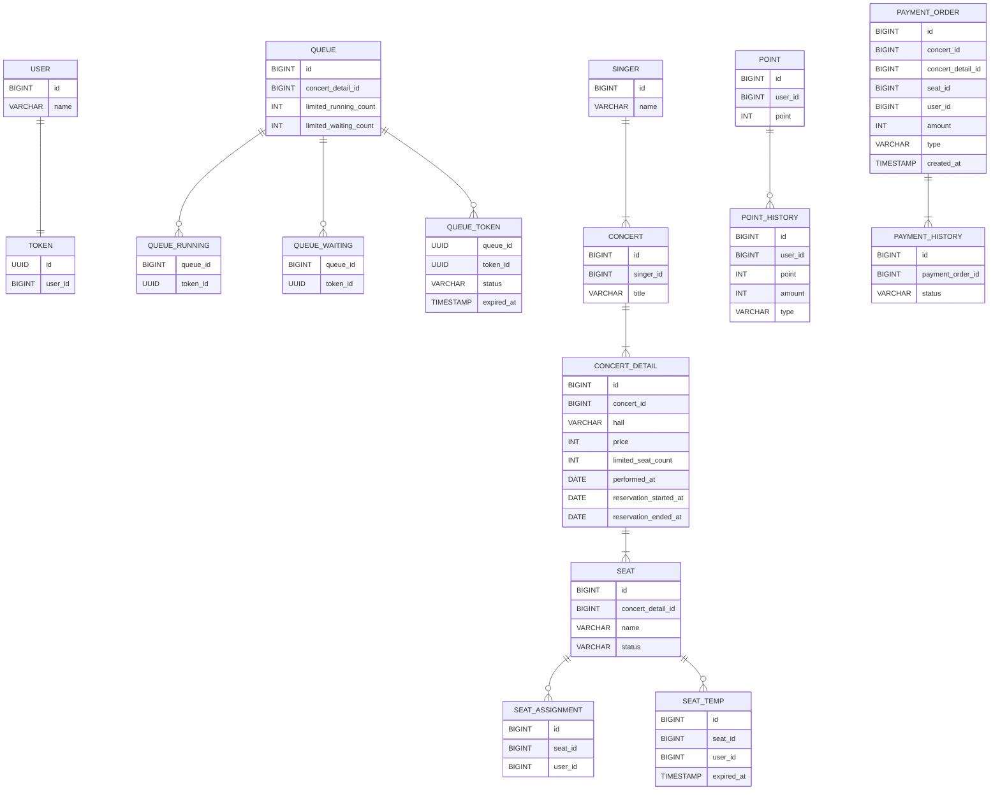

# 콘서트 예약 서비스
* 콘서트 예약 서비스 구현
* 사용자는 좌석예약 시 미리 충전한 잔액 사용
* 대기열 시스템 구축
* 좌석 예약 요청 시 결제가 이루어지지 않더라도 일정 시간동안 다른 유저가 해당 좌석에 접근할 수 없도록 제어

## API Specs
1. 유저 대기열 토큰 기능
    * 서비스를 이용할 토큰을 발급받는 API를 작성
    * 토큰은 유저의 UUID 와 해당 유저의 대기열을 관리할 수 있는 정보(대기 순서 or 잔여 시간 등) 를 포함
    * 이후 모든 API는 위 토큰을 이용해 대기열 검증을 통과해야 이용 가능
   > 기본적으로 폴링으로 본인의 대기열을 확인한다고 가정, 다른 방안 또한 고려해보고 구현 가능

2. 예약 가능 날짜 / 좌석 API
    * 예약가능한 날짜와 해당 날짜의 좌석을 조회하는 API를 각각 작성
    * 예약 가능한 날짜 목록을 조회 가능
    * 날짜 정보를 입력받아 예약가능한 좌석정보를 조회 가능
   > 좌석 정보는 1 ~ 50 까지의 좌석번호로 관리

3. 좌석 예약 요청 API
    * 날짜와 좌석 정보를 입력받아 좌석을 예약 처리하는 API를 작성
    * 좌석 예약과 동시에 해당 좌석은 그 유저에게 약 5분간 임시 배정(시간은 정책에 따라 자율적으로 정의)
    * 만약 배정 시간 내에 결제가 완료되지 않는다면 좌석에 대한 임시 배정은 해제되어야 하며, 다른 사용자는 예약할 수 없음

4. 잔액 충전 / 조회 API
    * 결제에 사용될 금액을 API를 통해 충전하는 API를 작성
    * 사용자 식별자 및 충전할 금액을 받아 잔액을 충전
    * 사용자 식별자를 통해 해당 사용자의 잔액을 조회

5. 결제 API
    * 결제 처리하고 결제 내역을 생성하는 API를 작성
    * 결제가 완료되면 해당 좌석의 소유권을 유저에게 배정하고, 대기열 토큰을 만료시킴

## Milestone
[Project Milestone Link](https://github.com/users/Yn3-3xh/projects/1/views/1)

## Domain Modeling
<div style="background-color: white; display: inline-block;">
    
</div>

## Sequence Diagram
### 1. 유저 대기열 토큰 기능
[유저 대기열 토큰 기능 Sequence Diagram](https://github.com/Yn3-3xh/hanghae-backend-plus/issues/4)


### 2. 예약 가능 날짜 / 좌석 API
[예약 가능 날짜 / 좌석 API Sequence Diagram](https://github.com/Yn3-3xh/hanghae-backend-plus/issues/5)


### 3. 좌석 예약 요청 API
[좌석 예약 요청 API Sequence Diagram](https://github.com/Yn3-3xh/hanghae-backend-plus/issues/6)


### 4. 잔액 충전 / 조회 API
[잔액 충전 / 조회 API Sequence Diagram](https://github.com/Yn3-3xh/hanghae-backend-plus/issues/7)


### 5. 결제 API
[결제 API Sequence Diagram](https://github.com/Yn3-3xh/hanghae-backend-plus/issues/8)


## ERD
[ERD Link](/docs/erd/erd.md)


## API 명세
[API 명세 Link](/src/main/resources/openapi.yaml)
```yaml
openapi: 3.0.0
info:
  title: 콘서트 예약 서비스 OPEN API
  version: 1.0.0
paths:
  /tokens:
    post:
      summary: 토큰 발급 API
      operationId: enrollToken
      parameters:
        - in: header
          name: X-USER-TOKEN
          schema:
            type: string
            format: uuid
      requestBody:
        content:
          application/json:
            schema:
              $ref: '#/components/schemas/TokenRequest'
      responses:
        '200':
          description: 새로 발급되거나 초기화된 사용자 인증 토큰 반환
          headers:
            X-USER-TOKEN:
              schema:
                type: string
                format: uuid
          content:
            application/json:
              schema:
                $ref: '#/components/schemas/TokenResponse'

  /concerts/{concertId}/performance-date/{date}/queues:
    get:
      summary: 대기열 확인 API
      operationId: checkConcertDateQueueCount
      parameters:
        - in: header
          name: X-USER-TOKEN
          required: true
          schema:
            type: string
            format: uuid
        - in: path
          name: concertId
          required: true
          schema:
            type: integer
        - in: path
          name: date
          required: true
          schema:
            type: string
            format: date
      responses:
        '200':
          description: 대기열 남은 순서 반환
          content:
            application/json:
              schema:
                $ref: '#/components/schemas/QueueCountResponse'

  /concerts/{concertId}/reservations/available:
    get:
      summary: 예약 가능 날짜 조회 API
      operationId: selectAvailableConcertDates
      parameters:
        - in: header
          name: X-USER-TOKEN
          schema:
            type: string
            format: uuid
        - in: path
          name: concertId
          required: true
          schema:
            type: integer
      responses:
        '200':
          description: 예약 가능한 날짜 목록 반환
          content:
            application/json:
              schema:
                $ref: '#/components/schemas/AvailableDatesResponse'

  /concerts/{concertId}/performance-date/{date}/seats/available:
    get:
      summary: 예약 가능 좌석 조회 API
      operationId: selectAvailableConcertSeats
      parameters:
        - in: header
          name: X-USER-TOKEN
          schema:
            type: string
            format: uuid
        - in: path
          name: concertId
          required: true
          schema:
            type: integer
        - in: path
          name: date
          required: true
          schema:
            type: string
            format: date
      responses:
        '200':
          description: 예약 가능한 좌석 목록 반환
          content:
            application/json:
              schema:
                $ref: '#/components/schemas/AvailableSeatsResponse'

  /concerts/{concertId}/performance-date/{date}/seats/{seatId}:
    post:
      summary: 좌석 예약 API
      operationId: reserveConcertSeat
      parameters:
        - in: header
          name: X-USER-TOKEN
          schema:
            type: string
            format: uuid
        - in: path
          name: concertId
          required: true
          schema:
            type: integer
        - in: path
          name: date
          required: true
          schema:
            type: string
            format: date
        - in: path
          name: seatId
          required: true
          schema:
            type: integer
      requestBody:
        content:
          application/json:
            schema:
              $ref: '#/components/schemas/SeatReservationRequest'
      responses:
        '200':
          description: 좌석 임시 배정 완료
          content:
            application/json:
              schema:
                $ref: '#/components/schemas/SeatReservationResponse'

  /points:
    post:
      summary: 잔액 충전 API
      operationId: chargePoint
      parameters:
        - in: header
          name: X-USER-TOKEN
          schema:
            type: string
            format: uuid
      requestBody:
        content:
          application/json:
            schema:
              $ref: '#/components/schemas/PointChargeRequest'
      responses:
        '200':
          description: 충전 완료 후 잔액 반환
          content:
            application/json:
              schema:
                $ref: '#/components/schemas/PointChargeResponse'

    get:
      summary: 잔액 조회 API
      operationId: selectPoint
      parameters:
        - in: header
          name: X-USER-TOKEN
          schema:
            type: string
            format: uuid
        - in: query
          name: userId
          schema:
            type: integer
      responses:
        '200':
          description: 현재 잔액 반환
          content:
            application/json:
              schema:
                $ref: '#/components/schemas/PointSelectResponse'

  /payments:
    post:
      summary: 결제 API
      operationId: processPayment
      parameters:
        - in: header
          name: X-USER-TOKEN
          schema:
            type: string
            format: uuid
      requestBody:
        content:
          application/json:
            schema:
              $ref: '#/components/schemas/PaymentRequest'
      responses:
        '200':
          description: 결제 완료
          content:
            application/json:
              schema:
                $ref: '#/components/schemas/PaymentResponse'

components:
  schemas:
    TokenRequest:
      type: object
      properties:
        userId:
          type: integer
          example: 1
    TokenResponse:
      type: object
      properties:
        token:
          type: string
          example: "21113572-4cb4-44ef-8e19-63269724b8be"
          format: uuid

    QueueCountResponse:
      type: object
      properties:
        count:
          type: integer
          example: 5

    AvailableDatesResponse:
      type: array
      items:
        type: string
        format: date
        example: "2024-10-20"

    AvailableSeatsResponse:
      type: array
      items:
        type: object
        properties:
          seatId:
            type: integer
            example: 3
          seatName:
            type: string
            example: "A-3"

    SeatReservationRequest:
      type: object
      properties:
        userId:
          type: integer
          example: 1
    SeatReservationResponse:
      type: object
      properties:
        message:
          type: string
          example: "좌석이 임시 배정되었습니다."

    PointChargeRequest:
      type: object
      properties:
        userId:
          type: integer
          example: 1
        amount:
          type: integer
          example: 20000
    PointChargeResponse:
      type: object
      properties:
        point:
          type: integer
          example: 25000

    PointSelectResponse:
      type: object
      properties:
        point:
          type: integer
          example: 25000

    PaymentRequest:
      type: object
      properties:
        userId:
          type: integer
          example: 1
        concertId:
          type: integer
          example: 1
        seatId:
          type: integer
          example: 1
        amount:
          type: integer
          example: 25000
    PaymentResponse:
      type: object
      properties:
        message:
          type: string
          example: 결제가 완료되었습니다.
        paymentId:
          type: integer
          example: 1
```

## 패키지 설계 구조
```text
├── api
│   ├── concert
│   │   ├── controller
│   │   └── dto
│   ├── payment
│   │   ├── controller
│   │   └── dto
│   ├── point
│   │   ├── controller
│   │   └── dto
│   └── token
│       ├── controller
│       └── dto
├── application
│   ├── concert
│   │   ├── facade
│   │   └── service
│   ├── payment
│   │   ├── facade
│   │   └── service
│   ├── point
│   │   ├── facade
│   │   └── service
│   ├── queue
│   │   └── service
│   ├── token
│   │   ├── facade
│   │   └── service
│   └── user
│       └── service
├── domain
│   ├── concert
│   │   ├── entity
│   │   └── repository
│   ├── payment
│   │   ├── entity
│   │   └── repository
│   ├── point
│   │   ├── entity
│   │   └── repository
│   ├── queue
│   │   ├── entity
│   │   └── repository
│   ├── token
│   │   ├── entity
│   │   └── repository
│   └── user
│       ├── entity
│       └── repository
└── infra
    ├── concert
    │   ├── jpa
    │   └── repository
    ├── payment
    │   ├── jpa
    │   └── repository
    ├── point
    │   ├── jpa
    │   └── repository
    ├── queue
    │   ├── jpa
    │   └── repository
    ├── token
    │   ├── jpa
    │   └── repository
    └── user
        ├── jpa
        └── repository
```

## 기술 스택
* 프로그래밍 언어 : Java 17
* 프레임워크 : SpringBoot 3.4
* 데이터베이스 : MySQL
* ORM : JPA
* 테스트 : JUnit, AssertJ
