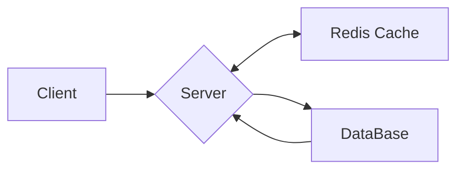
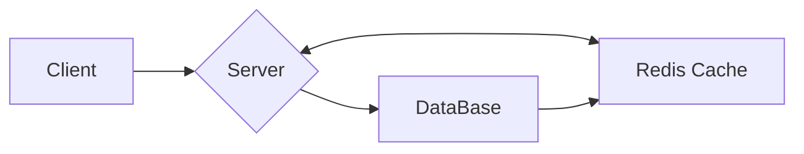
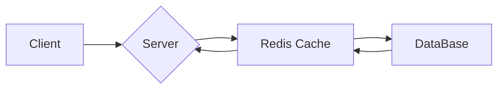

# 성능 개선 목록

* 대기열 성능 개선
  ```text
    지속적인 조회와 수시로 변경되는 데이터에 대해 디스크 기반의 RDBMS보다 성능이 좋은 인메모리 기반 Redis의 ZSet 자료구조를 선택했다.
    
    ZSet은 데이터가 정렬된 상태로 저장되며, 빠른 범위 조회와 순서 조회가 가능하여 대기열 처리에 최적화되어 있으므로,
    대기열의 상태를 실시간으로 관리하고, 높은 성능을 유지할 수 있다.
    특히 ZSet은 점수(score)를 기준으로 데이터를 정렬하므로, 우선순위나 순위 기반의 빠른 조회가 가능합니다.
  ```

> 우선 과제에 앞서 캐시와 레디스의 전략을 알아보자.
---

<details>
<summary>Cache / Caching</summary>

# Cache / Caching

* Cache
  ```text
  동일한 데이터에 반복해서 접근해야 하거나 많은 연산이 필요한 작업일 때 결과를 빠르게 하고자 성능이 좋은 혹은 가까운 곳에 저장하는 것이다.
  즉, 캐시는 컴퓨터의 성능을 향상 시키기 위해 사용되는 메모리를 의미하며, 자주 사용하는 데이터나 값을 미리 복사해 놓는 임시 장소를 가리킨다.
  ```

* Caching
  ```text
  데이터를 한 번 받아온 후에 그 데이터를 불러온 저장소보다 가까운 곳에 임시로 저장하여 필요시 더 빠르게 불러와서 사용하는 프로세스를 의미한다.
  ```

</details>

---

<details>
<summary>Server Caching Strategy</summary>

# Server Caching Strategy

## Application Level

* 애플리케이션의 메모리에 데이터를 저장해두고 같은 요청에 대해 데이터를 빠르게 접근해 반환함으로써 API 성능을 향상시킨다.
* Example
  ```java
  @Cacheable(cacheNames = "cache-name", key = "#query.id()")
  public List<Object> getList(XxxQuery.Xxx query) {
      ...
  }
  
  @CacheEvice(cacheNames = "cache-name", key = "#command.id()")
  public void evictList(XxxCommand.Xxx command) {
      ...
  }
  ```

* 메모리 캐시 원리
    1. API 요청 처리
        * 유저가 API 요청을 보낸다.
    2. 캐시 조회
        * Cache Hit: 요청한 데이터가 메모리 캐시에 이미 존재하면, 캐시에서 데이터를 조회하고 응답을 준비한다.
        * Cache Miss: 요청한 데이터가 캐시에 없으면, 비즈니스 로직을 수행한다. (예: 데이터베이스 조회, 외부 API 호출 등)
    3. 비즈니스 로직 수행 (Cache Miss 시)
        * 데이터베이스나 외부 시스템과 통신하여 필요한 데이터를 가져온다.
        * 가져온 데이터를 메모리 캐시에 저장한다.
    4. 응답 반환
        * 데이터를 응답으로 반환한다.
        * 이 데이터는 캐시에 저장되므로 후속 요청에서는 캐시에서 빠르게 데이터를 제공할 수 있다.

* 메모리 캐시 특징
    * 신속성
        * 인스턴스의 메모리에 캐시 데이터를 저장하므로 속도가 가장 빠르다.
    * 저비용
        * 인스턴스의 메모리에 캐시 데이터를 저장하므로 별도의 네트워크 비용이 발생하지 않는다.
    * 휘발성
        * 애플리케이션이 종료될 때 캐시 데이터는 삭제된다.
    * 메모리 부족
        * 활성화된 애플리케이션 인스턴스에 데이터를 올려 캐싱하는 방법이므로 메모리 부족으로 인해 비정상 종료로 이어질 수 있다.
    * 분산 환경 문제
        * 분산 환경에서 서로 다른 서버 인스턴스 간에 데이터 불일치 문제가 발생할 수 있다.

## External Level

* 별도의 캐시 저장소 또는 이를 담당하는 API 서버를 통해 캐싱 환경을 제공한다.

* 캐시 서비스 원리
    1. API 요청 처리
        * 유저가 API 요청을 보낸다.
    2. 캐시 조회
        * Cache Hit: 요청한 데이터가 캐시 서비스에 존재하면, 캐시에서 데이터를 가져와서 응답을 준비한다.
        * Cache Miss: 요청한 데이터가 캐시 서비스에 없으면, 비즈니스 로직을 수행한다. (예: 데이터베이스 조회, 외부 API 호출 등)
    3. 비즈니스 로직 수행 (Cache Miss 시)
        * 비즈니스 로직을 통해 필요한 데이터를 조회한다.
        * 조회한 데이터를 캐시 서비스에 저장하여, 이후의 요청에서 빠르게 반환될 수 있도록 한다.
    4. 응답 반환
        * 비즈니스 로직에서 가져온 데이터를 응답으로 반환한다.
        * 이후 동일한 요청에 대해서는 캐시 서비스에서 빠르게 데이터를 조회하여 응답할 수 있다.

* 캐시 서비스 특징
    * 일관성
        * 별도의 담당 서비스를 둠으로써 분산 환경(multi-instance)에서도 동일한 캐시 기능을 제공할 수 있다.
    * 안정성
        * 외부 캐시 서비스의 디스크에 스냅샷을 저장하여 장애 발생 시 복구가 용이하다.
    * 고가용성
        * 각 인스턴스에 의존하지 않으므로 분산 환경을 위한 HA 구성이 용이하다.
    * 고비용
        * 네트워크 통신을 통해 외부의 캐시 서비스와 소통해야 하므로 네트워크 비용 또한 고려해야 한다.

</details>

---

<details>
<summary>Redis</summary>

# Redis

## Cache 읽기 전략

### Look Aside Pattern

* Cache Aside Pattern 이라고도 한다.
* 데이터를 찾을때 우선 캐시에 저장된 데이터가 있는지 우선적으로 확인하는 전략으로, 만일 캐시에 데이터가 없으면 DB에서 조회한다.
* 반복적인 읽기가 많은 호출에 적합하다.
* 캐시와 DB가 분리되어 가용되기 때문에 원하는 데이터만 별도로 구성하여 캐시에 저장한다.
* 캐시와 DB가 분리되어 가용되기 때문에 캐시 장애 대비 구성이 되어있다.
    * 만약에 redis가 다운되더라도 DB에서 데이터를 가져올 수 있어서 서비스 자체에는 문제가 없다.
    * 대신에 캐시에 붙어있던 connection이 많았다면, reids가 다운된 순간 순간적으로 DB로 몰려서 부하가 발생한다.


* 원리
    ```mermaid
        graph LR
            A[Client] --> B{Server}
            C -- "(1) Cache Hit" <--> B
            B -- "(3) Cache Update" --> C[Redis Cache]
            B -- "(2) Cache Miss" <--> D[DataBase]
    ```
    1. Redis Cache에 검색하는 데이터가 있는지 확인 (Cache Hit)
    2. Redis Cache에 없을 경우 DB에서 데이터 조회 (Cache Miss)
    3. DB에서 조회해온 데이터를 Redis Cache에 업데이트

```text
Look Aside Pattern은 애플리케이션에서 캐싱을 이용할때 일반적으로 사용되는 기본적인 캐시 전략이다.

이 방식은 캐시에 장애가 발생하더라도 DB에 요청을 전달함으로써 캐시 장애로 인한 서비스 문제는 대비할 수 있지만,
Redis Cache와 DB 간 정합성 유지 문제가 발생할 수 있으며, 초기 조회 시 무조건 DB를 호출해야 하므로,
단건 호출 빈도가 높은 서비스에는 적합하지 않고, 반복적으로 동일 쿼리를 수행하는 서비스에 적합한 아키텍처이다.

이런 경우 DB에서 캐시로 데이터를 미리 넣어주는 작업을 하기도 한다. (Cache Warming)
```

### Read Through Pattern

* 캐시에서만 데이터를 읽어오는 전략 (inline cache)
* Look Aside와 비슷하지만 데이터 동기화를 라이브러리 또는 캐시 제공자에게 위임하는 방식이라는 차이가 있다.
* 데이터를 조회하는데 있어 전체적으로 속도가 느리다.
* 데이터 조회를 전적으로 캐시에만 의지하므로, redis가 다운될 경우 서비스 이용에 차질이 생길 수 있다.
* 캐시와 DB 간의 데이터 동기화가 항상 이루어져 데이터 정합성 문제에서 벗어날 수 있다.
* 읽기가 많은 워크로드에 적합하다.


* 원리
  ```mermaid
    graph LR
        A[Client] --> B{Server}
        C -- "(1) Cache Hit" <--> B
        B -- "(3)" <--> C[Redis Cache]
        C -- "(2-1) Cache MISS" --> D[DataBase]
        D -- "(2-2) Cache Update" --> C
  ```
    1. Redis Cache에 검색하는 데이터가 있는지 확인 (Cache Hit)
    2. Redis Cache에 없을 경우 캐시에서 DB에 데이터를 조회하여 자체 업데이트 (Cache Miss)
    3. Cache에서 데이터를 가져옴

```text
Read Through 방식은 Cache Aside 방식과 비슷하지만, Redis Cache에 저장하는 주체가 Server인지 DB인지에서 차이가 있다.

이 방식은 직접적인 DB 접근을 최소화하고, Read에 대한 소모되는 자원을 최소화할 수 있다.
하지만, 캐시에 문제가 발생했을 경우 바로 서비스 전체 중단으로 빠질 수 있다.
그러므로 redis와 같은 구성 요소를 Replication 또는 Cluster로 구성하여 가용성을 높여야 한다.
```

## Cache 쓰기 전략

### Write Back Pattern

* Write Behind Pattern 으로도 불린다.
* 캐시와 DB 동기화를 비동기하기 때문에 동기화 과정이 생략된다.
* 데이터를 저장할때 DB에 바로 쿼리하지 않고, 캐시에 모아서 일정 주기 배치 작업을 통해 DB에 반영한다.
* 캐시를 모아놨다가 DB에 쓰기 때문에 쓰기 쿼리 회수 비용과 부하를 줄일 수 있다.
* Write가 빈번하면서 Read를 하는데 많은 양의 Resource가 소모되는 서비스에 적합하다.
* 데이터 정합성이 확보된다.
* 자주 사용되지 않는 불필요한 리소스가 저장된다.
* 캐시에서 오류가 발생하면 데이터가 영구 소실된다.


* 원리
  ```mermaid
      graph LR
        A[Client] --> B{Server}
        B -- "(1)" --> C[Redis Cache]
        C -- "(2) 스케줄링" --> D[DataBase]
  ```
    1. 모든 데이터를 Redis Cache에 저장
    2. 일정 시간이 지난 뒤 DB에 저장

```text
Write Back 방식은 데이터를 저장할때 DB가 아닌 먼저 캐시에 저장하여 모아놓았다가 특정 시점마다 DB로 쓰는 방식으로 일종의 Queue 역할을 겸하게 된다.

캐시에 데이터를 모았다가 한 번에 DB에 저장하기 때문에 DB 쓰기 횟수 비용과 부하를 줄일 수 있지만,
데이터를 옮기기 전에 캐시 장애가 발생하면 데이터 유실이 발생할 수 있다는 단점이 존재한다.
하지만 오히려 반대로 DB에 장애가 발생하더라도 지속적인 서비스를 제공할 수 있도록 보장하기도 한다.
```

### Write Through Pattern

* DB와 Cache에 동시에 데이터를 저장하는 전략이다.
* 데이터를 저장할 때 먼저 캐시에 저장한 다음 바로 DB에 저장한다.(모아놓았다가 나중에 저장이 아닌 바로 저장)
* Read Through와 마찬가지로 DB 동기화 작업을 캐시에게 위임한다.
* DB와 캐시가 항상 동기화 되어 있어서 캐시의 데이터는 항상 최신 상태로 유지된다.
* 캐시와 백업 저장소에 업데이트를 같이 하여 데이터 일관성을 유지할 수 있어서 안정적이다.
* 데이터 유실이 발생하면 안되는 상황에 적합하다.
* 자주 사용되지 않는 불필요한 리소스가 저장된다.
* 매 요청마다 두번의 Write가 발생하게 됨으로써 빈번한 생성, 수정이 발생하는 서비스에서는 성능 이슈가 발생한다.
* 기억장치 속도가 느릴 경우 데이터를 기록할 때 CPU가 대기하는 시간이 필요하기 때문에 성능이 감소한다.


* 원리
  ```mermaid
    graph LR
        A[Client] --> B{Server}
        B -- "(1)" --> C[Redis Cache]
        C -- "(2)" --> D[DataBase]
  ```
    1. DB에 저장할 데이터가 있으면 우선 Reids Cache에 저장
    2. 바로 Redis Cache에서 DB로 저장

```text
Write Through Pattern은 Redis Cache에도 반영하고, DB에도 동시에 반영하는 방식이다. (Write Back은 일정 시간을 두고 나중에 한꺼번에 저장)

그래서 항상 동기화가 되어 있어 항상 최신정보를 가지고 있다는 장점이 있다.
하지만, 결국 저장할때마다 2단계 과정을 거쳐지기 때문에 상대적으로 느리며, 
일단 Redis Cache에 저장하기 때문에 캐시에 넣은 데이터를 저장만 하고 사용하지 않을 가능성이 있어서 리소스 낭비 가능성이 있다.
```

> Write Through 패턴과 Write Back 패턴 모두 자주 사용되지 않는 데이터가 저장되어 리소스 낭비가 발생되는 문제점을 안고 있기 때문에, 이를 해결하기 위해 TTL을 꼭 사용하여 사용되지 않는
> 데이터를 반드시 삭제해야 한다. (expire 명령어)

### Write Around Pattern

* Write Through 보다 훨씬 빠르다.
* 모든 데이터는 DB에 저장한다. (캐시를 갱신하지 않음)
* Cache Miss가 발생하는 경우에만 DB와 캐시에도 데이터를 저장한다.
    * 따라서 캐시와 DB 내의 데이터가 다를 수 있다. (데이터 불일치)


* 원리
  ```mermaid
    graph LR
        A[Client] --> B{Server}
        B -- "(2) Cache Miss" --> C[Redis Cache]
        B -- "(1)" --> D[DataBase]
  ```
    1. 모든 데이터는 DB에 저장
    2. Cache Miss 시 캐시에도 저장

```text
Write Around Pattern은 속도가 빠르지만, 
Cache Miss가 발생하기 전에 DB에 저장된 데이터가 수정되었을 때 사용자가 조회하는 Cache와 DB 간의 데이터 불일치가 발생하게 된다.

따라서 DB에 저장된 데이터가 수정, 삭제될 때마다, Cache도 삭제하거나 변경해야 하며, Cache의 expire를 짧게 조정하는 식으로 대처해야 한다.
```

## Cache 읽기 + 쓰기 전략

### Look Aside + Write Around

* 가장 일반적으로 자주 쓰이는 조합



### Read Through + Write Around

* 항상 DB에 쓰고, 캐시에서 읽을 때 항상 DB에서 먼저 읽어오므로 데이터 정합성 이유에 대한 완벽한 안전 장치를 구성할 수 있다.



### Read Through + Write Through

* 데이터를 쓸 때 항상 캐시에 먼저 쓰므로, 읽어올 때 최신 캐시 데이터를 보장한다.
* 데이터를 쓸 때 항상 캐시에서 DB로 보내므로, 데이터 정합성을 보장한다.



</details>

---

# 정리

* 대기열(RDBMS) 조회 테스트
  
* 대기열(Redis) 조회 테스트
  

```text
현재 속도 차이는 크지 않지만 향후 데이터 증가와 사용량 증가에 따라 Redis를 활용하는 것이 성능 개선에 도움이 될 것으로 보인다.
특히, 대기열은 자주 변경되고 빠른 응답이 필요한 데이터이기 때문에 RDBMS 보다 Redis가 더 적합하다고 생각한다.

구현에 있어서는 큰 차이가 있다고 느꼈다.
RDBMS를 사용하면 대기열을 위한 별도의 테이블 설계가 필요했고, 만료 시간을 관리하기 위한 추가적인 로직도 작성해야 하므로 구현이 복잡했다.
예를 들어 만료된 데이터를 정리하는 스케줄러나 추가적인 데이터 모델링이 필요했다.

반면, Redis를 사용하면 ZSet 자료구조를 통해 대기열을 별도의 테이블 없이 NoSQL 방식으로 관리할 수 있다. 
또한, TTL 기능을 통해 자동으로 만료 시간을 설정할 수 있어서 스케줄러 없이도 만료된 데이터를 관리할 수 있으므로, 
이를 통해 구현 복잡도를 낮춰 간결한 코드 작성이 가능해졌다.
```

---

# 참고

* [캐시/캐싱이란?](https://velog.io/@effypark/%EC%BA%90%EC%8B%9C-%EC%BA%90%EC%8B%B1%EC%9D%B4%EB%9E%80)
* [캐시 메모리](https://velog.io/@letskuku/%EC%BB%B4%ED%93%A8%ED%84%B0%EA%B5%AC%EC%A1%B0-%EC%BA%90%EC%8B%9C-%EB%A9%94%EB%AA%A8%EB%A6%AC)
* [[REDIS] 📚 캐시(Cache) 설계 전략 지침 💯 총정리](https://inpa.tistory.com/entry/REDIS-%F0%9F%93%9A-%EC%BA%90%EC%8B%9CCache-%EC%84%A4%EA%B3%84-%EC%A0%84%EB%9E%B5-%EC%A7%80%EC%B9%A8-%EC%B4%9D%EC%A0%95%EB%A6%AC#look_aside_%ED%8C%A8%ED%84%B4)