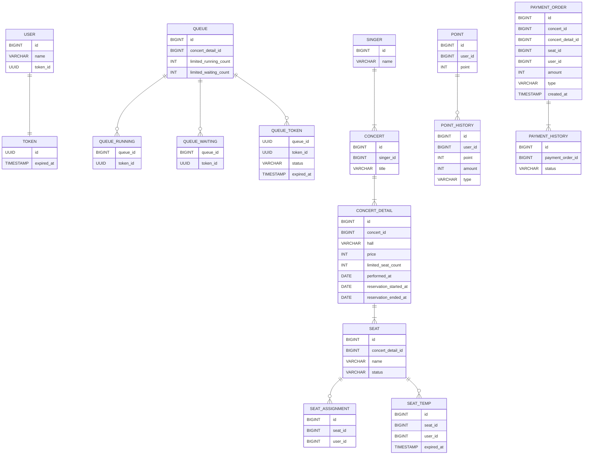

```mermaid
erDiagram
    USER {
        BIGINT id
        VARCHAR name
        UUID token_id
    }
    TOKEN {
        UUID id
        TIMESTAMP expired_at
    }

    QUEUE {
        BIGINT id
        BIGINT concert_detail_id
        INT limited_running_count
        INT limited_waiting_count
    }
    QUEUE_RUNNING {
        BIGINT queue_id
        UUID token_id
    }
    QUEUE_WAITING {
        BIGINT queue_id
        UUID token_id
    }
    QUEUE_TOKEN {
        UUID queue_id
        UUID token_id
        VARCHAR status
        TIMESTAMP expired_at
    }

    CONCERT {
        BIGINT id
        BIGINT singer_id
        VARCHAR title
    }
    CONCERT_DETAIL {
        BIGINT id
        BIGINT concert_id
        VARCHAR hall
        INT price
        INT limited_seat_count
        DATE performed_at
        DATE reservation_started_at
        DATE reservation_ended_at
    }
    SINGER {
        BIGINT id
        VARCHAR name
    }
    SEAT {
        BIGINT id
        BIGINT concert_detail_id
        VARCHAR name
        VARCHAR status
    }
    SEAT_TEMP {
        BIGINT id
        BIGINT seat_id
        BIGINT user_id
        TIMESTAMP expired_at
    }
    SEAT_ASSIGNMENT {
        BIGINT id
        BIGINT seat_id
        BIGINT user_id
    }

    POINT {
        BIGINT id
        BIGINT user_id
        INT point
    }
    POINT_HISTORY {
        BIGINT id
        BIGINT user_id
        INT point
        INT amount
        VARCHAR type
    }

    PAYMENT_ORDER {
        BIGINT id
        BIGINT concert_id
        BIGINT concert_detail_id
        BIGINT seat_id
        BIGINT user_id
        INT amount
        VARCHAR type
        TIMESTAMP created_at
    }
    PAYMENT_HISTORY {
        BIGINT id
        BIGINT payment_order_id
        VARCHAR status
    }

    USER ||--|| TOKEN: ""

    QUEUE ||--o{ QUEUE_RUNNING: ""
    QUEUE ||--o{ QUEUE_WAITING: ""
    QUEUE ||--o{ QUEUE_TOKEN: ""

    SINGER ||--|{ CONCERT: ""
    CONCERT ||--|{ CONCERT_DETAIL: ""
    CONCERT_DETAIL ||--|{ SEAT: ""
    SEAT ||--o{ SEAT_ASSIGNMENT: ""
    SEAT ||--o{ SEAT_TEMP: ""

    POINT ||--o{ POINT_HISTORY: ""

    PAYMENT_ORDER ||--|{ PAYMENT_HISTORY: ""
```