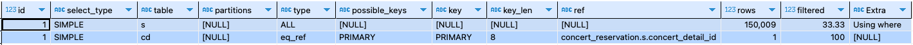
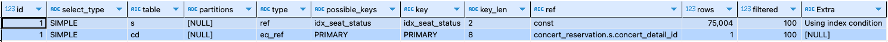

## 쿼리 성능 개선 목록

* ~~예약 가능 날짜 조회~~
* 예약 가능 좌석 조회

## 쿼리 성능 분석

* `EXPLAIN`
    * id
        * SELECT에 붙은 번호
      > 참고: MySQL은 조인을 하나의 단위로 실행하기 때문에 id는 그 쿼리에 실행 단위를 식별하는 것이므로 조인만 실행하는 쿼리에서는 id가 항상 1
    * select_type
        * 복잡한 조인을 해도 항상 SIMPLE
      > 참고: 서브 쿼리나 UNION이 있으면 id와 select_type이 변함
    * table
        * 어떤 테이블에 대한 접근하는지를 표시
    * partitions
        * 파티셔닝이 되어 있는 경우에 사용됨
    * type (아래로 갈수록 좋은 type)
        1. ALL: 전체 테이블을 스캔하는 방식으로, 가장 비효율적
        2. index: 인덱스를 사용해 전체 테이블을 스캔하는 방식
        3. range: 인덱스를 사용해 범위 검색을 하는 방식 (ex. BETWEEN, >, <)
        4. index_subquery: unique_subquery 와 비슷하나 Primary key가 오는 특수한 경우
        5. unique_subquery: in 절 안에 서브쿼리에서 Primary key가 오는 특수한 경우
        6. index_merge : 두개의 인덱스가 병합되어 검색이 이루어지는 경우
        7. ref_or_null : ref 와 같지만 null 이 추가되어 검색되는 경우
        8. ref: 비유니크 인덱스를 사용해 특정 값에 일치하는 여러 행을 찾는 방식
        9. eq_ref: 유니크 인덱스나 기본 키를 사용해 각 행을 단일 인덱스 항목과 일치시키는 방식으로, 매우 효율적이며, 쿼리 성능이 가장 좋음
        10. const: 쿼리에서 비교하는 값이 상수일 때 사용하는 방식으로, 매우 효율적
        11. system: 시스템 테이블에 대한 접근 방식으로, 테이블이 하나의 행만 포함할 때 발생하며, 가장 빠른 유형 중 하나
    * possible_keys
        * 이용 가능성이 있는 인덱스의 목록
    * key
        * 이용 가능성이 있는 인덱스의 목록 중에서 실제로 옵티마이저가 선택한 인덱스
      > 참고: NULL 값이라면 행 데이터를 가져오기 위해 인덱스를 사용할 수 없다는 의미
    * key_len
        * 선택된 인덱스의 길이
      > 참고: 인덱스가 너무 긴 것도 비효율적일 수 있음
    * ref
        * key 컬럼에 나와 있는 인덱스에서 값을 찾기 위해 선행 테이블의 어떤 컬럼이 사용되었는지를 표시
    * rows
        * 해당 실행 계획으로 몇 행을 가져왔는지를 표시
        * 최초에 접근하는 테이블에 대해서 쿼리 전체에 의해 접근하는 행 수, 그 이후에 테이블에 대해서는 1행의 조인으로 평균 몇 행에 접근했는가를 표시
      > 통계값을 바탕으로 계산된 값이므로 현실의 값과 반드시 일치하지 않음.
    * filtered
        * 행 데이터를 가져와 WHERE 조건이 적용되면 몇 행이 남는지를 표시
      > 통계값을 바탕으로 계산된 값이므로 현실의 값과 반드시 일치하지 않음.
    * Extra
        * Using where: 테이블에서 행을 가져온 후 추가적으로 검색조건을 적용해 행의 범위를 축소한 것을 표시
        * Using index: 테이블에는 접근하지 않고 인덱스에서만 접근해서 쿼티를 해결하는 것을 의미하며, 커버링 인덱스로 처리됨
        * Using index for group-by: Using index와 유사하지만 GROUP BY가 포함되어 있는 쿼리를 커버링 인덱스로 해결할 수 있음을 표시
        * Using filesort: ORDER BY 인덱스로 해결하지 못하고 filesort(MySQL의 quick sort)로 행을 정렬한 것을 표시
        * Using temporary: 암묵적으로 임시 테이블이 생성된 것을 표시
        * Using where with pushed: 엔진 컨디션 pushdown 최적화가 일어난 것을 표시하며, 현재는 NDB만 유효
        * Using index condition: 인덱스 컨디션 pushdown(ICP) 최적화가 일어났음을 표시
        * Using MRR: 멀티 레인지 리드(MRR) 최적화가 사용되었음을 표시
        * Using join buffer(Block Nested Loop): 조인에 적절한 인덱스가 없어 조인 버퍼를 이용했음을 표시
        * Using join buffer(Batched Key Access): Batched Key Access(BKAJ) 알고리즘을 위한 조인 버퍼를 사용했음을 표시

* `EXPLAIN ANAYZE`
    * 실행 계획 (cost, rows)
        * cost: 쿼리를 싱행하기 위한 예상 비용
        * rows: 예상 출력 행 개수
    * 실제 실행 비용 (actual time, rows, loops)
        * cost: 쿼리를 싱행하기 위한 실제 비용
        * actual time: 시작 시간과 끝난 시간을 의미하며, 실제로 소요된 시간을 표시
        * rows: 실제 출력 행 개수
        * loops: 각 단계에서 반복된 횟수를 의미

* 참고
    * [Mysql Explain](https://cheese10yun.github.io/mysql-explian/)
    * [MYSQL EXPLAIN](https://velog.io/@pkt369/MYSQL-EXPLAIN)
    * [[DB] MySQL에서 Explain을 이용하여 실행 계획 분석하기](https://velog.io/@jeong_hun_hui/MySQL%EC%97%90%EC%84%9C-Explain%EC%9D%84-%EC%9D%B4%EC%9A%A9%ED%95%98%EC%97%AC-%EC%8B%A4%ED%96%89-%EA%B3%84%ED%9A%8D-%EB%B6%84%EC%84%9D%ED%95%98%EA%B8%B0)
    * [[MySQL] 쿼리 수행시간 분석하는 방법 (EXPLAIN ANALYZE)](https://june-coder.tistory.com/64)
    * [[MySQL] Explain 사용법 및 분석](https://hoestory.tistory.com/57)

### 예약 가능 좌석 조회

* 예상 실행 계획
  ```mysql
    EXPLAIN
    SELECT
        *
    FROM
        concert_detail cd
    JOIN
        seat s
        ON cd.id = s.concert_detail_id
    WHERE
        s.status = 'EMPTY'
  ```
    * index 추가 전

      
    * index 추가 후
        ```mysql
        CREATE INDEX idx_seat_status ON seat(status)
        ```
      
    * 정리
      ```text
      [인덱스 추가 전]
      table s에서 possible_keys와 key 컬럼이 [NULL]로 표시되어 있으므로, 사용 가능한 인덱스가 없어 옵티마이저가 인덱스를 활용할 수 없는 상태임을 나타낸다.
      이로 인해 type이 ALL로 표시되며, Full Scan을 수행한다.
      따라서 150,009개의 모든 행을 순차적으로 읽게되어 가장 비효율적인 접근 방식으로 보인다.
        
      [인덱스 추가 후]
      idx_seat_status 인덱스가 추가되어 key 컬럼에 해당 인덱스가 지정되었다.
      또한, type이 ref로 변경되었는데, 이는 인덱스를 사용한 동등 조건 검색이 이루어졌음을 의미한다.
      따라서 인덱스 사용으로 검색 대상이 150,009행에서 75,004행으로 줄어들어 성능이 개선되었다.
      ```

* 실제 실행 계획
  ```mysql
    EXPLAIN ANALYZE 
    SELECT
        *
    FROM
        concert_detail cd
    JOIN
        seat s
        ON cd.id = s.concert_detail_id
    WHERE
        s.status = 'EMPTY'
  ```
    * index 추가 전
        ```text
        -> Nested loop inner join  (cost=32638 rows=50003) (actual time=20..80.6 rows=75000 loops=1)
        -> Filter: (s.`status` = 'EMPTY')  (cost=15137 rows=50003) (actual time=19.9..64.9 rows=75000 loops=1)
        -> Table scan on s  (cost=15137 rows=150009) (actual time=0.151..53.7 rows=150000 loops=1)
        -> Single-row index lookup on cd using PRIMARY (id=s.concert_detail_id)  (cost=0.25 rows=1) (actual time=67.5e-6..91.5e-6 rows=1 loops=75000)
        ```
    * index 추가 후
        ```text
        -> Nested loop inner join  (cost=34161 rows=75004) (actual time=0.275..125 rows=75000 loops=1)
        -> Index lookup on s using idx_seat_status (status='EMPTY'), with index condition: (s.`status` = 'EMPTY')  (cost=7909 rows=75004) (actual time=0.223..106 rows=75000 loops=1)
        -> Single-row index lookup on cd using PRIMARY (id=s.concert_detail_id)  (cost=0.25 rows=1) (actual time=82.4e-6..111e-6 rows=1 loops=75000)
        ```
* 정리
  ```text
  [cost 분석]
  * 전체 조인 비용: 32,638(예상 행 수: 50,003) -> 34,161(예상 행 수: 75,004)
      - 예상 행 수가 정확해졌으나 전체 비용은 소폭 증가 (+4.67%)
  
  * 필터링 비용: 15,137(예상 행 수: 150,009) -> 7,909(예상 행 수: 75,004)
      - 인덱스 사용으로 실제 필요한 행만 접근하여 비용 절반 감소 (-47.7%)

  [actual time 분석]
  * 필터링 시간: 19.9ms ~ 64.9ms -> 0.223ms ~ 106ms
      - 초기 접근은 매우 빨라졌으나, 전체 처리 시간은 증가 (−98.87%, +63.7%)
  
  * cd 테이블 단일 행 인덱스 조회: 67.5e-6ms ~ 91.5e-6ms -> 82.4e-6ms ~ 111e-6ms (75,000번 조회)
      - 조회 횟수는 동일하나 처리 시간 소폭 증가 (+22.2%, +21.3%)

  [결론]
  idx_seat_status 인덱스를 추가한 결과, 전체 조인 비용은 감소했고, 필터링 시간은 증가했다. 
  비용 감소는 인덱스를 통해 불필요한 데이터 접근을 줄이고, 더 적합한 행만 처리하게 되어 효율성이 향상되었기 때문이다. 
  반면, 필터링 시간이 증가한 것은 인덱스를 사용하면서 더 정확한 데이터 접근이 이루어졌기 때문에 일부 추가적인 처리 시간이 소요된 결과이다.

  데이터셋이 커질수록 인덱스를 사용하는 것이 더 효율적일 것으로 판단되며, 이는 인덱스를 통해 쿼리 성능을 최적화하고 불필요한 데이터를 줄일 수 있기 때문이다.
  특히, 데이터셋이 증가하면서 인덱스가 성능 향상에 긍정적인 영향을 미칠 것이라 생각한다.
  ```